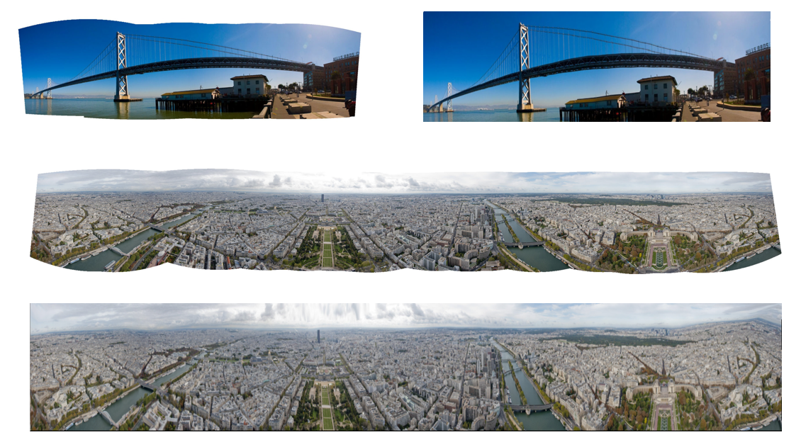
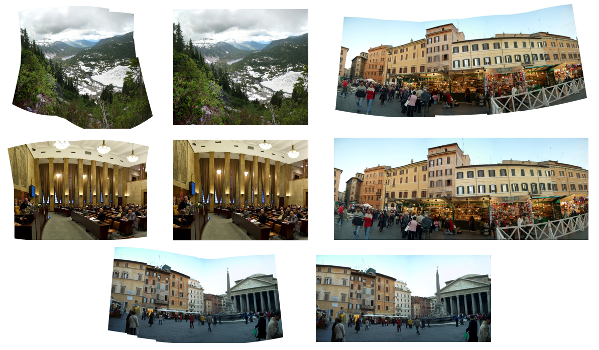

# My implementation of "Rectangling Panoramic Images via Warping"

## Assignment
第二轮考察要求相似，需要用C++实现：https://mmcheng.net/imageresizing/ 这个页面下面链接的这个论文 Rectangling Panoramic Images via Warping。同样准备PPT面试。交互界面和图像变形部分建议调用OpenGL的纹理贴图来实现。正常的程序执行时间5s以内，请不要明显超过这个时间。
请在2周之内完成这个测试。  

## Result
### seam carving

### get displacement map

### mesh warped backward

### line detect

### global warping iteration

### line preservation compare

### other results


## bilinear interpolation
https://theailearner.com/2018/12/29/image-processing-nearest-neighbour-interpolation/  
https://theailearner.com/2018/12/29/image-processing-bilinear-interpolation/
https://iquilezles.org/articles/ibilinear/  
For the situation in the paper, the quad is a trapezoid, we can use Inverse Bilinear Interpolation to get the weight of four vertices.  


## Find the minimum of a quadratic form
the energy function E is a quadratic function on V and can be optimized via solving a linear system

## Line Detection
for the line detection, we use the code from here(an improved version of LSD algorithm)  
http://www.ipol.im/pub/art/2012/gjmr-lsd/


## Dependencies
### install opengl
```angular2html
sudo apt-get install libglew-dev freeglut3-dev
```
### install opencv
```
# Install minimal prerequisites (Ubuntu 18.04 as reference)
sudo apt update && sudo apt install -y cmake g++ wget unzip pkg-config
sudo apt-get install libavformat-dev libavcodec-dev libswscale-dev
# Download and unpack sources
wget -O opencv.zip https://github.com/opencv/opencv/archive/4.x.zip
wget -O opencv_contrib.zip https://github.com/opencv/opencv_contrib/archive/4.x.zip
unzip opencv.zip
unzip opencv_contrib.zip
# Create build directory and switch into it
mkdir -p build && cd build
# Configure
cmake -DWITH_FFMPEG=ON -DOPENCV_EXTRA_MODULES_PATH=../opencv_contrib-4.x/modules ../opencv-4.x
# Build
cmake --build .
# Install 
sudo make install 
```
